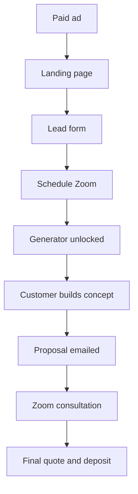
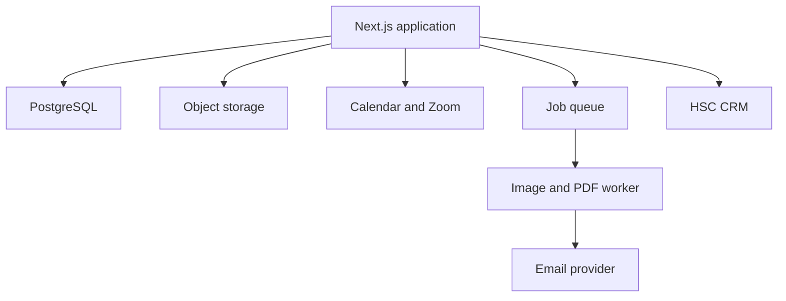

# Houston Sign Crafters Storefront Sign Generator

## Product Requirements Document

**Version:** 1.0  
**Status:** Proposed MVP  
**Owner:** Houston Sign Crafters  
**Last updated:** August 30, 2026  
**Primary market:** U.S. businesses purchasing storefront signage  
**Initial product scope:** Illuminated storefront channel letters and logo signs

---

## 1. Executive Summary

Houston Sign Crafters will build a customer-facing storefront sign generator that turns paid-ad traffic into qualified, scheduled sales appointments.

The customer promise is a free storefront sign mockup with a preliminary installed-price range. However, the generator is not an unrestricted design toy. Access is unlocked only after the prospect submits contact and project information and schedules a Zoom consultation.

The customer then completes the basic site survey before the call:

1. Upload a storefront photo.
2. Square up the photo manually.
3. Mark the storefront width and enter it.
4. Upload a logo or enter sign text.
5. Select basic sign preferences.
6. Position and size the sign.
7. Generate the mockup and preliminary estimate.

The complete result is delivered to the supplied email address in a proposal-style format. The same project is available to the salesperson before the scheduled Zoom. The call is used to confirm the design, installation conditions, final price, and deposit.

The product should reduce sales discovery time, qualify prospects through productive work, and allow Houston Sign Crafters to test national Meta and Google advertising without requiring a salesperson to manually prepare every early-stage concept.

---

## 2. Product Thesis

Buying a storefront sign creates two major uncertainties:

- What will the finished sign look like on the building?
- What will the project cost?

The generator answers both questions before the sales conversation.

The customer-facing experience is a lead magnet. Operationally, it is an appointment incentive and pre-call qualification system.

The product succeeds when it produces profitable sign deposits, not when it produces the largest possible number of mockups or inexpensive leads.

---

## 3. Locked Product Decisions

| Decision | MVP requirement |
| --- | --- |
| Calendar gate | A prospect must schedule a Zoom before accessing the generator. |
| Email gate | No email passcode or one-time verification code. The full result is delivered by email. |
| Account requirement | No password or conventional customer account is required. |
| Generator access | A successful calendar booking creates an unguessable project link. |
| Reference measurement | The customer marks the storefront width left-to-right and enters it (no default value). |
| Wall corners | The customer does not need to mark wall corners. |
| Photo correction | The customer manually controls straighten, vertical perspective, horizontal perspective, and crop. |
| Price display | Prices are shown as an estimate range computed from project cost: the low end is a 35% gross margin, the high end is a 60% gross margin. Target sale margin is 40–50%. The range is intentionally wide to drive the prospect to the consultation for a final price. |
| Result delivery | The full mockup and preliminary estimate are emailed. The completion page may show only a thumbnail or limited preview. |
| Final quote | The generated estimate is non-binding. Final price requires human confirmation. |
| MVP sign categories | Storefront channel letters and one-piece illuminated logo signs. Unsupported projects route to manual quoting. |
| Production measurements | Generated dimensions are for sales estimation only. A final field survey is still required. |

---

## 4. Goals

### 4.1 Business goals

- Generate qualified national storefront-sign opportunities from Meta and Google Ads.
- Increase the percentage of leads who schedule a sales consultation.
- Ensure scheduled prospects arrive with a design, dimensions, and preliminary pricing expectations.
- Reduce salesperson time spent on basic discovery and early design work.
- Improve call show rates through customer investment in the project.
- Shorten the time from first inquiry to deposit.
- Capture structured design and project data that can later support permitting, production, and installation workflows.

### 4.2 Customer goals

- Visualize a proposed sign on the actual storefront.
- Understand the likely project budget before investing time in a sales call.
- Explore basic visual options without understanding sign-industry terminology.
- Receive a professional document that can be shared with partners or landlords.
- Enter the consultation with a concrete design to discuss.

### 4.3 Primary success metric

**Gross profit from deposits divided by advertising spend.**

Lead cost and generator completions are diagnostic metrics, not the primary measure of success.

---

## 5. Non-Goals for MVP

The MVP will not:

- Produce permit-ready or fabrication-ready drawings.
- Guarantee exact measurements from a photograph.
- Automatically identify wall corners.
- Require email OTP verification.
- Support monuments, pylons, tenant panels, vehicle wraps, interior sign systems, or wayfinding packages.
- Automatically research every local sign code.
- Replace the final site survey.
- Generate structural engineering documents.
- Automatically quote unusual electrical, crane, traffic-control, or access requirements.
- Provide unlimited free concepts to one prospect.
- Operate as a public design tool for sign companies or graphic designers.
- Take payment in the first release.

---

## 6. Target Customer

### 6.1 Primary customer

A business owner, operator, franchisee, developer, or facilities manager who:

- Has an identifiable storefront location.
- Expects to purchase signage within six months.
- Needs exterior storefront signage.
- Can upload a storefront photo and logo.
- Can reasonably spend at least $5,000 on the project.
- Is willing to attend a short design and pricing consultation.

### 6.2 Poor-fit traffic

- Consumers seeking banners, yard signs, decals, or sub-$1,000 products.
- Users without a storefront or installation address.
- Designers using the tool only to produce free renderings.
- Sign companies seeking free production work.
- Projects requiring monument, pylon, multi-tenant, or complex architectural estimating in MVP.

Poor-fit traffic should be routed to a manual inquiry form or disqualified without consuming generator resources.

---

## 7. End-to-End Funnel



### 7.1 Funnel rules

- The lead must be saved before the calendar is shown.
- Lead-form information must prefill the scheduler to avoid duplicate entry.
- Generator access must not unlock until the scheduler confirms a successful booking.
- The booking confirmation page must immediately redirect or link to the generator.
- The booking confirmation email must include a resume link to the generator.
- The proposal email must reference the scheduled meeting date and time.
- The salesperson must receive the same project information before the call.

---

## 8. Detailed Customer Journey

## 8.1 Landing Page

### Purpose

Explain the outcome, filter poor-fit traffic, and begin the project.

### Recommended headline

> See your new storefront sign before you buy it.

### Recommended subheadline

> Create a free storefront mockup, receive an estimated installed price, and review it with a sign specialist.

### Required content

- Before-and-after storefront examples.
- Day and night mockup examples.
- Explanation that most illuminated storefront projects begin around $5,000.
- Three-step explanation: schedule, design, review.
- Customer proof and Houston Sign Crafters credentials.
- Primary CTA: **Create My Free Sign Concept**.

### Acceptance criteria

- UTMs, `gclid`, `gbraid`, `wbraid`, `fbclid`, landing-page variant, and referring URL are stored.
- The page is usable on mobile and desktop.
- The CTA opens the lead form without a page refresh when practical.

---

## 8.2 Lead Form

### Required fields

- First and last name
- Business name
- Email
- Mobile phone
- Installation address
- Desired installation timing
- Sign need

### Sign-need options

- New storefront sign
- Replace an existing storefront sign
- Add another storefront sign
- Not sure
- Different sign type

### Timing options

- Within 30 days
- 31–60 days
- 61–90 days
- 3–6 months
- More than 6 months

### Behavior

- Create the lead immediately after form submission.
- Validate email syntax but do not require a passcode.
- Normalize the phone number.
- Verify the installation address through address autocomplete when available.
- Prefill the scheduling widget with name, email, phone, and business name.
- Route unsupported sign types to manual follow-up while still allowing scheduling.

### Acceptance criteria

- A lead record exists even if the prospect abandons the calendar.
- Repeated submissions from the same email or phone append activity to the existing lead when confidence is high.
- Consent language is recorded for email and text follow-up.

---

## 8.3 Zoom Scheduling Gate

### Required behavior

- Embed or redirect to the selected scheduling provider.
- Offer only approved consultation hours.
- Automatically create the Zoom meeting.
- Store the appointment ID, time, timezone, status, and join URL.
- Unlock the generator only after the booking webhook is received or the booking success state is verified.
- Send a booking confirmation containing the generator resume link.

### Generator access token

- Use a long, unguessable token rather than a customer password.
- Associate the token with one lead, appointment, and project.
- Allow access for at least 30 days.
- Limit the MVP to one primary concept per booked appointment, with admin overrides.
- If an appointment is canceled before the proposal is generated, require rescheduling before final submission.

### Acceptance criteria

- A user cannot reach the generator solely by guessing a URL.
- Refreshing or leaving the page does not lose the project.
- Rescheduling updates the existing appointment rather than creating a duplicate project.

---

## 8.4 Generator Welcome Screen

### Required content

- Explain that completion normally takes approximately 5–10 minutes.
- List required items: storefront photo and logo.
- Explain that measurements and pricing are preliminary.
- Show the scheduled consultation time.
- Provide a **Start My Design** button.

### Progress model

The public generator should use four clear stages:

1. Project Details
2. Site Survey
3. Sign Design
4. Proposal

Progress must save after every material action.

---

## 8.5 Project Details

### Required fields

- Business display name
- Confirmed installation address
- New sign or replacement sign
- Opening date or desired installation date
- Landlord approval status
- Existing sign removal required: yes, no, or unknown
- Optional project notes

### Landlord options

- Approved
- Approval pending
- Have not asked
- I own the building
- Not sure

These fields support lead qualification and sales preparation. They do not block the generator.

---

## 8.6 Storefront Photo Upload

### Supported sources

- Mobile camera
- Device upload
- Desktop drag and drop

### Supported file types

- JPEG
- PNG
- HEIC, converted after upload

### Requirements

- Preserve the original file.
- Correct EXIF orientation automatically.
- Create optimized working and thumbnail versions.
- Warn when resolution is too low.
- Warn when the storefront is heavily obstructed or photographed at an extreme angle.
- Allow the user to replace the photo without restarting the project.

### MVP constraints

- Maximum original upload size: 25 MB.
- Minimum recommended image width: 1,500 pixels.
- One primary storefront photo per concept.

---

## 8.7 Square Up Photo

### Customer controls

- Straighten rotation
- Vertical perspective
- Horizontal perspective
- Crop
- Zoom and pan
- Reset
- Apply

### Technical behavior

- Store transform parameters separately from the original image.
- Apply transforms non-destructively.
- Render a grid overlay while editing.
- Export a corrected working image after the user selects **Apply**.
- If the transform changes later, measurement and sign-placement coordinates must update consistently.

### MVP implementation recommendation

- Use a browser canvas layer with WebGL or a proven perspective-transform library.
- Use OpenCV.js only where needed for homography and export.
- Do not attempt automatic facade or corner detection in MVP.

### Acceptance criteria

- The user can visually make the sign band horizontal and storefront columns vertical.
- Reset restores the original image.
- Applying the correction does not permanently overwrite the source photo.

---

## 8.8 Reference Measurement

### Customer experience

The app asks the customer to mark the width of the storefront, left to right — the one measurement a business owner will actually take (a tape across the front) or already knows (frontage from the lease or plans).

Default prompt:

> Drag the two dots to the ends of the storefront, then enter its width.

### Required controls

- One horizontal line with two draggable endpoints, spanning most of the photo by default
- Width entry in feet and inches — **no default value**: a guessed width must never silently drive pricing, so the step blocks until the customer enters one
- Zoom and pan for precise endpoint placement
- Reset measurement

Door heights, brick coursing, and other reference types were considered and rejected: too complicated for non-designers. Plane-mismatch and accuracy concerns are handled by staff-side confidence flags, not extra customer steps.

### Calculation

```text
reference_inches = entered feet × 12 + entered inches
inches_per_pixel = reference_inches ÷ reference_line_pixels

estimated_sign_width_inches = sign_width_pixels × inches_per_pixel
estimated_sign_height_inches = sign_height_pixels × inches_per_pixel
```

### Assumptions

- The door and sign are approximately on the same facade plane.
- The customer has adequately squared the photo.
- Lens distortion and depth differences may introduce error.
- Dimensions are preliminary and require a final field survey.

### Confidence rules

Flag the estimate for manual review when:

- The reference line is unusually short in pixels.
- The photo remains heavily skewed.
- The proposed sign is on a visibly different plane from the door.
- The entered reference is outside reasonable commercial-door ranges.

---

## 8.9 Logo and Artwork

### Supported inputs

- SVG
- PDF
- PNG
- JPEG

### Required behavior

- Prefer vector artwork when available.
- Preserve aspect ratio by default.
- Detect whether a raster logo lacks transparency.
- Offer simple background removal when confidence is high.
- Allow the user to enter sign text when no logo exists.
- Store the original and normalized artwork separately.

### Failure handling

If artwork cannot be processed, allow the customer to finish the project and flag it for manual design support.

---

## 8.10 Sign Configuration

The customer-facing controls must be understandable without sign-industry expertise.

### Required customer choices

- Sign type:
  - Individual channel letters
  - One-piece illuminated logo sign
  - Not sure—recommend one
- Lighting:
  - Front-lit
  - Halo-lit
  - Combination
  - Non-illuminated
  - Not sure
- Mounting:
  - Directly to the wall
  - Raceway
  - Not sure
- Primary face color
- Return color
- Trim color when applicable
- Day view and night view

### Internal-only or advanced fields

- Face material
- Exact acrylic or polycarbonate selection
- Return depth
- Trim-cap depth
- LED manufacturer
- Power-supply details
- Fasteners and mounting pattern
- Raceway construction
- UL and production notes

Internal defaults may be applied automatically based on the selected sign type. A salesperson or estimator can modify them before issuing the final quote.

---

## 8.11 Mockup Composition

### Required controls

- Add logo artwork
- Add text
- Move
- Resize while preserving aspect ratio
- Rotate
- Align horizontally and vertically
- Duplicate
- Delete
- Undo and redo
- Show estimated width and height while resizing
- Toggle day and night views

### Placement behavior

- The proposed sign is positioned on the corrected facade image.
- Size is calculated from the reference measurement.
- Customer changes update dimensions and pricing in real time or after a short debounce.
- The app warns when the sign appears unusually small or large relative to the storefront.
- A customer may override the recommendation within configured limits.

### Existing-sign removal

The MVP should support one of two operational modes:

1. **Automated cleanup:** an image-editing service removes the existing sign from the facade.
2. **Human review fallback:** the project is submitted with the existing sign visible and flagged for staff cleanup before the proposal is sent.

Geometric placement and dimensions must never depend on a generative image model. AI may clean or enhance the background, but the measured sign layer must remain deterministic.

### Day rendering

- Render face, return, trim, depth, and realistic shadow layers.
- Maintain the exact customer-selected size and position.

### Night rendering

- Darken the storefront background without changing geometry.
- Add controlled face or halo illumination based on the selected lighting type.
- Preserve readable brand colors.

---

## 8.12 Estimate Engine

### Output

The engine produces:

- Preferred sale price
- Displayed low estimate
- Displayed high estimate
- Included items
- Allowances
- Exclusions
- Estimate confidence
- Manual-review flags

### Cost and display rules

The base formula estimates **project cost**, not selling price. Margin is applied on top.

```text
project_cost = (piece_height_inches × piece_count × 7.05) + 2,000
             + 400 per backer plate
             + 400 flat if the job uses a wireway (raceway), regardless of count

For channel letters: piece_height = letter height, piece_count = letter count.
For a one-piece illuminated logo sign: piece_count = 1, piece_height = overall sign height.

displayed_low  = project_cost ÷ (1 − 0.35)   // 35% gross margin
displayed_high = project_cost ÷ (1 − 0.60)   // 60% gross margin
target_sale    = project_cost ÷ (1 − 0.40) … project_cost ÷ (1 − 0.50)
```

The coefficient ($7.05), base ($2,000), add-ons ($400), and all three margin points must be admin-configurable. Both displayed figures should be rounded using an admin-configurable rule, such as the nearest $50 or $100.

The range is deliberately wide (the high end is ~1.6× the low end). This is intentional: the estimate anchors the budget and motivates the prospect to attend the consultation for a final price. The low end (35% margin) is the floor Houston Sign Crafters would accept; the target close is 40–50% margin.

### Pricing inputs

- Sign type
- Letter count
- Letter or logo height
- Overall width and height
- Illumination type
- Mounting method
- Sign quantity
- Removal requirement
- Installation geography
- Installation allowance
- Permit allowance
- Engineering allowance
- Electrical allowance
- Acquisition-channel allowance
- Target margin
- Minimum project price

### Confirmed HSC seed values

These are the confirmed launch values; all remain admin-configurable:

- Cost coefficient: `$7.05` per inch of piece height per piece. **Confirmed: this produces project cost, not selling price.**
- Base project cost: `$2,000`.
- Backer plate: `+$400` each.
- Wireway (raceway): `+$400` flat per job when used, regardless of how many.
- Displayed low margin: 35%. Displayed high margin: 60%. Target sale margin: 40–50%.

Still to seed before launch:

- Default permit allowance.
- Optional acquisition-channel allowance.
- Minimum illuminated-project price.
- Whether the $2,000 base fully covers standard installation or a separate installation allowance is needed for out-of-region projects.

### Margin calculation rule

The engine operates in **gross-margin mode**: selling price = cost ÷ (1 − margin). A 40% margin means `cost ÷ 0.60`, not `cost × 1.40`. The admin interface must label margin inputs clearly to prevent markup/margin confusion.

### Estimate confidence

- **High:** supported sign type, usable photo, valid measurement, standard installation assumptions, known service region.
- **Medium:** one or more allowances remain uncertain.
- **Low:** unusual access, unsupported geography, weak measurement, complex removal, or nonstandard sign.

Low-confidence projects must not automatically send a narrow estimate without staff approval.

### Required disclaimer

> This is a preliminary budget estimate based on customer-provided information and photographic measurements. Final pricing is subject to site verification, landlord requirements, permitting, engineering, electrical conditions, access, and approved scope.

---

## 8.13 Proposal Generation

### Document name

**Preliminary Sign Concept & Budget Estimate**

Do not label the automated document as a final or binding proposal.

### Required sections

1. Houston Sign Crafters cover and contact information
2. Customer and installation location
3. Scheduled consultation date and time
4. Day mockup
5. Night mockup when applicable
6. Preliminary sign dimensions
7. Recommended sign configuration
8. Estimated project investment
9. Included services
10. Assumptions and exclusions
11. Next steps

### Price presentation example

For ten 24-inch channel letters, wall-mounted, no backer or wireway:
cost = (24 × 10 × 7.05) + 2,000 = $3,692 → low $5,700 (35% margin), high $9,250 (60% margin).

> **Estimated project investment: $5,700–$9,250**

The lower figure is a 35% gross-margin price Houston Sign Crafters would willingly accept under the stated assumptions. The width of the range is intentional — final pricing is confirmed on the consultation.

### Required next step

> We will review this concept, confirm installation conditions, and finalize pricing during your scheduled consultation.

### PDF generation

- Build the proposal as responsive HTML.
- Render the PDF using a headless browser.
- Store a versioned proposal record.
- Preserve the pricing inputs used for each version.

---

## 8.14 Email Delivery

### Email rule

The complete proposal and high-resolution mockups are delivered to the email entered in the lead form. No email passcode is required.

### Recommended subject

> Your storefront sign concept for {{business_name}}

### Required email content

- Customer's first name
- Mockup thumbnail
- Estimated investment range
- Scheduled consultation date and time
- Link to the full web proposal
- Attached PDF proposal
- Calendar-management link
- Generator resume or revision link

### Completion page

The browser completion screen should display:

- Confirmation that the proposal was sent
- Masked or full destination email
- Small or watermarked mockup preview
- **Resend Email** button
- **Wrong Email?** correction flow
- Scheduled appointment information

### Delivery handling

- Log delivered, bounced, opened, and clicked events when available.
- Notify staff when a proposal email hard-bounces.
- Allow staff to correct the address and resend.
- Do not block MVP launch on advanced deliverability verification.

---

## 8.15 Pre-Call Reminders

### If the generator is incomplete

Send reminders:

- Immediately after booking
- 24 hours before the call
- Two hours before the call

The reminders should link directly to the saved project.

### If the generator is complete

Send the proposal and meeting reminders emphasizing that the salesperson will review the submitted design.

### Sales notification

Notify the assigned salesperson when:

- A call is booked.
- The generator is completed.
- The estimate requires manual review.
- The proposal is opened.
- The meeting is within two hours and the generator remains incomplete.

---

## 8.16 Zoom Consultation

### Salesperson workspace

Before the call, the salesperson must see:

- Contact information
- Attribution source
- Address and project timing
- Landlord status
- Original and corrected storefront photos
- Reference measurement
- Logo files
- Selected sign configuration
- Day and night mockups
- Estimated dimensions
- Pricing calculation and assumptions
- Proposal-open activity
- Any confidence warnings

### Call objective

- Confirm the design direction.
- Confirm decision-maker and landlord status.
- Verify installation conditions and exclusions.
- Make live revisions where practical.
- Confirm final scope and price.
- Request the 50% deposit.

### Post-call

- Issue the final formal proposal or QuickBooks estimate.
- Record show, no-show, qualified, lost, won, and deposit events.
- Preserve the preliminary proposal separately from the final commercial document.

---

## 9. Internal Admin Requirements

### 9.1 Lead and project dashboard

Required statuses:

- Lead captured
- Booking incomplete
- Call booked
- Generator not started
- Generator in progress
- Generator completed
- Manual review required
- Proposal sent
- Proposal opened
- Call completed
- No-show
- Final quote sent
- Won
- Lost

### 9.2 Admin actions

- View and edit lead details
- Resend generator access link
- Resend proposal
- Correct email address
- Replace or edit source assets
- Adjust photo transform
- Adjust reference measurement
- Edit sign placement and configuration
- Override estimate inputs
- Approve a low-confidence estimate
- Regenerate proposal
- Assign salesperson
- Record meeting outcome

### 9.3 Pricing administration

- Configure pricing coefficients
- Configure minimum prices
- Configure install, permit, engineering, electrical, and acquisition allowances
- Configure geographic modifiers
- Select markup or gross-margin pricing mode
- Configure range percentage
- Configure rounding
- Publish pricing-rule versions

Every estimate must retain the pricing-rule version used to generate it.

---

## 10. CRM and Advertising Integrations

### 10.1 Existing CRM

The generator should send structured events to the existing Houston Sign Crafters CRM rather than creating a separate sales system.

### Required CRM events

- `lead_created`
- `appointment_booked`
- `appointment_rescheduled`
- `appointment_canceled`
- `generator_opened`
- `photo_uploaded`
- `generator_started`
- `generator_completed`
- `manual_review_required`
- `proposal_generated`
- `proposal_sent`
- `proposal_delivered`
- `proposal_opened`
- `proposal_clicked`
- `meeting_showed`
- `meeting_no_show`
- `final_quote_sent`
- `deposit_paid`
- `lead_won`
- `lead_lost`

### 10.2 Advertising attribution

Persist the original attribution data throughout the project and sale:

- Source
- Medium
- Campaign
- Ad set or ad group
- Ad or creative
- Keyword
- Landing-page variant
- Click identifiers

### 10.3 Conversion events

Send browser and server-side events where supported:

- Lead
- Scheduled consultation
- Completed generator
- Qualified opportunity
- Deposit paid, including conversion value

Use a shared event ID to deduplicate browser and server events.

Optimize advertising toward deposits or qualified completed projects once sufficient conversion volume exists, not raw lead-form submissions.

---

## 11. Recommended Technical Architecture

### 11.1 Guiding principle

The architecture should be simple enough for one engineer to operate. Avoid separate services until image rendering or traffic requires them.

### 11.2 Recommended stack

| Layer | Recommendation |
| --- | --- |
| Web application | Next.js with TypeScript |
| UI | React, Tailwind CSS, and a small component system |
| Interactive canvas | React Konva or Fabric.js |
| Perspective correction | WebGL transform library with OpenCV.js fallback |
| Server image processing | Sharp initially; Python/OpenCV worker only where necessary |
| Database | PostgreSQL |
| Object storage | Cloudflare R2 or Amazon S3 |
| Background jobs | Redis-backed queue or managed job system |
| Email | Resend or Postmark |
| SMS | Twilio |
| Scheduling | Calendly or Cal.com with Zoom integration |
| PDF generation | HTML templates rendered with Playwright |
| Hosting | Railway for the application, database, and worker where practical |
| Monitoring | Structured logs, error tracking, and job-failure alerts |

### 11.3 Service layout



### 11.4 Rendering principles

- Keep geometry, measurement, sign placement, and pricing deterministic.
- Store original assets and editing parameters.
- Regenerate outputs from saved source data.
- Use AI only for background cleanup, enhancement, or optional visual polish.
- Do not allow an AI-generated image to change the sign's calculated dimensions.

---

## 12. Data Model

### Lead

- `id`
- `name`
- `business_name`
- `email`
- `phone`
- `installation_address`
- `desired_timing`
- `sign_need`
- `consent_email`
- `consent_sms`
- `source_attribution`
- `crm_lead_id`
- `created_at`

### Appointment

- `id`
- `lead_id`
- `provider`
- `provider_event_id`
- `scheduled_at`
- `timezone`
- `status`
- `zoom_join_url`
- `reschedule_url`
- `cancel_url`

### Project

- `id`
- `lead_id`
- `appointment_id`
- `access_token_hash`
- `status`
- `business_display_name`
- `installation_address`
- `opening_date`
- `landlord_status`
- `removal_required`
- `notes`
- `expires_at`

### Asset

- `id`
- `project_id`
- `asset_type`
- `original_storage_key`
- `working_storage_key`
- `thumbnail_storage_key`
- `mime_type`
- `width`
- `height`
- `metadata`

### PhotoTransform

- `id`
- `asset_id`
- `rotation`
- `vertical_perspective`
- `horizontal_perspective`
- `crop`
- `zoom`
- `pan`
- `transform_matrix`

### Measurement

- `id`
- `project_id`
- `photo_asset_id`
- `start_point`
- `end_point`
- `known_inches`
- `pixel_length`
- `inches_per_pixel`
- `confidence`

### SignDesign

- `id`
- `project_id`
- `sign_type`
- `lighting_type`
- `mounting_type`
- `artwork_asset_id`
- `text_elements`
- `canvas_transform`
- `estimated_width_inches`
- `estimated_height_inches`
- `colors`
- `advanced_specs`
- `design_version`

### PricingEstimate

- `id`
- `project_id`
- `sign_design_id`
- `pricing_rule_version`
- `input_snapshot`
- `preferred_sale_price`
- `displayed_low`
- `displayed_high`
- `confidence`
- `flags`
- `approved_by`

### Proposal

- `id`
- `project_id`
- `pricing_estimate_id`
- `version`
- `web_url_token_hash`
- `pdf_storage_key`
- `email_status`
- `sent_at`
- `opened_at`

### FunnelEvent

- `id`
- `lead_id`
- `project_id`
- `event_name`
- `event_id`
- `properties`
- `occurred_at`

---

## 13. API and Webhook Requirements

### Public application endpoints

- Create lead
- Create or retrieve project
- Upload asset
- Save photo transform
- Save measurement
- Save design
- Calculate estimate
- Submit project
- Resend proposal
- Correct email and resend

### Webhooks

- Scheduling created
- Scheduling rescheduled
- Scheduling canceled
- Email delivered
- Email bounced
- Email opened
- Proposal clicked
- Payment received in a later phase

### Security requirements

- Verify webhook signatures.
- Rate-limit public endpoints.
- Use signed upload URLs.
- Store only hashed generator and proposal access tokens.
- Prevent one project token from accessing another project's data.
- Remove sensitive values from client logs and analytics payloads.

---

## 14. Analytics

### Funnel measurements

- Landing-page visitor → lead submitted
- Lead submitted → appointment booked
- Appointment booked → generator opened
- Generator opened → generator completed
- Generator completed → proposal delivered
- Proposal delivered → proposal opened
- Generator completed → meeting attended
- Meeting attended → final quote
- Final quote → deposit
- Advertising spend → gross profit

### Product measurements

- Median generator completion time
- Drop-off by generator step
- Photo-upload failure rate
- Photo-square-up completion rate
- Measurement-confidence distribution
- Manual-review rate
- Render failure rate
- Proposal delivery and bounce rate
- Resend rate
- Mobile versus desktop completion

### Initial validation targets

These are starting targets, not promises:

- Lead → scheduled consultation: at least 35%
- Scheduled consultation → completed generator: at least 50%
- Completed generator → attended consultation: at least 65%
- Attended consultation → deposit: at least 20%

The funnel should ultimately be judged by contribution margin and gross profit per advertising dollar.

---

## 15. Notifications and Recovery

### Customer recovery

- Calendar abandoned: send a scheduling reminder when consent permits.
- Generator not started: send the saved access link.
- Generator abandoned: send the exact resume link and show current progress.
- Proposal bounced: allow email correction through a secure project link.
- Appointment rescheduled: update the proposal and reminder schedule.

### Internal recovery

- Rendering failure creates an admin task.
- Low-confidence estimates enter a manual-review queue.
- Unsupported sign types enter a manual-quote queue.
- Hard-bounced proposals alert the assigned salesperson.
- Failed CRM and advertising events retry with idempotency.

---

## 16. Non-Functional Requirements

### Performance

- Standard pages should become interactive within three seconds on a modern mobile connection.
- Autosave should complete without interrupting editing.
- Normal deterministic mockup and PDF generation should complete within 60 seconds.
- Long-running image cleanup should show progress and support retry.

### Reliability

- Every meaningful generator action is autosaved.
- Background jobs are idempotent.
- Proposal generation can be safely retried.
- A failed integration must not delete or corrupt the project.

### Mobile usability

- The lead form, calendar, upload, square-up, measurement, and basic placement steps must work on a phone.
- Precise advanced editing may be easier on desktop, but mobile cannot be an unsupported afterthought because most Meta traffic will arrive on mobile.

### Accessibility

- Keyboard support for desktop controls where practical.
- Sufficient color contrast.
- Text alternatives for important imagery.
- Controls cannot rely solely on color.

### Privacy and retention

- Publish a clear privacy notice for uploaded storefront and logo files.
- Define retention for abandoned projects.
- Allow staff to delete a project and its assets.
- Do not use customer assets to train public models without explicit permission.

---

## 17. MVP Release Plan

The tool is built internal-first. Staff use it to produce real mockups and estimates before any customer touches it. The customer-facing release is a simplification of a proven internal tool, not a separate build.

### Phase 0: Internal Mockup Tool

Build the complete core pipeline, operated by staff only:

- Storefront photo and logo upload
- Manual square-up editor
- Door-height reference measurement
- Sign placement and sizing on the corrected photo
- Basic sign configuration (type, lighting, mounting, colors)
- Deterministic day rendering
- Configurable pricing engine with confidence rules
- HTML and PDF proposal generation
- Manual proposal email send

Purpose:

Prove the hardest engineering — perspective correction, measurement math, deterministic rendering, and pricing — with expert users who can catch errors a customer never would. No access tokens, no wizard flow, no customer UX polish.

Exit criteria:

- Staff can take a real storefront photo from upload to emailed proposal PDF.
- Mockup quality is good enough to use in advertising.

### Phase 1: Funnel Validation (parallel with Phase 0)

Build the marketing funnel independently — it does not require the generator:

- Landing page, using Phase 0 mockups as before/after and day/night examples
- Lead form with attribution capture
- Calendar gate with Zoom integration
- Booking confirmation and reminder emails
- CRM and attribution events

Staff use the internal tool from Phase 0 to prepare mockups and proposals for booked calls (concierge mode).

Purpose:

Validate whether the offer produces scheduled calls, show-ups, and deposits at acceptable ad cost — before investing in customer-facing self-service. The funnel and the tool are separate bets; test them in parallel.

### Phase 2: Customer-Facing Generator

Convert the internal tool into the public wizard:

- Four-stage guided wizard (Project Details, Site Survey, Sign Design, Proposal)
- Mobile-first simplification of square-up, measurement, and placement
- Generator access-token flow tied to booking
- Autosave and resume
- Night rendering
- Automated proposal email delivery
- Automated reminders and abandoned-flow recovery

The internal version remains as the salesperson and admin workspace with full override controls.

Gate for launch:

A non-expert on a phone can complete square-up, measurement, and placement unattended. This is the product's central UX bet and requires real-prospect testing, not just removing admin buttons.

### Phase 3: Image Cleanup and Deeper Automation

Add:

- Automated existing-sign removal
- Photo enhancement
- Internal advanced sign controls
- Live salesperson revisions during the Zoom
- Proposal version comparison
- Deeper CRM automation

### Phase 4: National Expansion

Add:

- Installer-network pricing
- Geographic installation modifiers
- Permit and engineering allowances by market
- Additional sign products
- Multi-location projects
- Customer payment and deposit workflow

---

## 18. MVP Priorities

### Must have

- Paid-ad landing page
- Lead capture and attribution
- Required Zoom booking
- Generator access token
- Autosaved project
- Photo and logo upload
- Manual photo square-up
- Seven-foot reference measurement
- Sign placement and resizing
- Basic channel-letter configuration
- Estimated dimensions
- Configurable pricing calculation
- Preliminary proposal generation
- Email-only full-result delivery
- CRM status and event sync
- Staff review and override

### Should have

- Day and night views
- Existing-sign cleanup
- Proposal-open tracking
- Automated reminders
- Email correction and resend
- Low-confidence review queue

### Could have

- Live co-editing during Zoom
- Automatic logo background removal
- Suggested sign size
- AI visual enhancement
- Online deposit

### Will not have in MVP

- Automated permitting
- Production drawings
- Structural engineering
- Unlimited sign categories
- Customer login and password
- Email verification passcode

---

## 19. Launch Acceptance Criteria

The MVP is ready for paid traffic when:

1. A new visitor can submit a lead and schedule a Zoom.
2. Booking successfully unlocks a unique generator project.
3. The user can leave and resume without losing work.
4. A mobile user can upload and square a storefront photo.
5. The user can mark a door as seven feet and receive calculated dimensions.
6. The user can upload a logo, position it, and select basic sign options.
7. The system calculates project cost from the confirmed formula and displays a 35%-margin low and 60%-margin high estimate.
8. The system can stop or route low-confidence estimates for staff review.
9. The full proposal is emailed without requiring an email passcode.
10. The proposal contains mockups, dimensions, range, assumptions, and meeting information.
11. The salesperson can access the completed project before the Zoom.
12. Funnel and attribution events reach the CRM without duplicates.
13. A failed render, PDF, email, or webhook can be retried safely.
14. The final document clearly states that measurements and pricing are preliminary.

---

## 20. Key Risks and Mitigations

| Risk | Mitigation |
| --- | --- |
| Calendar gate reduces volume | Measure deposits per ad dollar rather than raw leads; later test generator-first as a controlled variant. |
| Users book fake appointments to unlock the tool | Require real business address, phone, project timing, and meaningful generator work; limit free concepts. |
| Customers abandon the detailed workflow | Autosave, show progress, keep customer-facing choices simple, and send resume reminders. |
| Photo dimensions are inaccurate | Require manual square-up, use a known reference, calculate confidence, and label dimensions preliminary. |
| Customers anchor to the lower estimate | Make the lower bound a price HSC is willing to accept and clearly state assumptions. |
| National installation costs exceed the estimated cost basis | Use regional allowances, exclude uncertain work, or require staff review before sending; the 35–60% margin spread absorbs moderate variance. |
| AI changes sign geometry | Keep measured sign rendering deterministic and use AI only on background layers. |
| Proposal feels binding | Title it preliminary and repeat the site-verification disclaimer. |
| Technical options confuse customers | Keep advanced fabrication settings internal and provide “Not sure” recommendations. |
| Building the renderer takes too long | Launch the concierge funnel first and automate only proven bottlenecks. |

---

## 21. Open Product Decisions

These decisions should be resolved during implementation planning:

1. Which scheduling provider will be used?
2. Will a canceled appointment immediately revoke proposal submission?
3. How many concepts or revisions are included per booked consultation?
4. Which metropolitan areas can receive an automated installation estimate at launch?
5. Which existing-sign-removal provider or human fallback will be used?
6. Does the MVP show the full mockup on-screen after submission or only a thumbnail?
7. Which estimate inputs require staff approval nationally?
8. Will the final Zoom call support live editing in the first release?
9. What minimum project price will be shown in advertising?
10. ~~Which pricing coefficients are costs versus final selling-price rules?~~ **Resolved: the $7.05 formula produces project cost; the engine runs in gross-margin mode (display range 35%–60%, target 40–50%).**

---

## 22. Recommended Build Order

### Internal tool track (Phase 0)

1. Project data model and asset upload
2. Photo square-up controls
3. Measurement calibration
4. Artwork and sign-placement canvas
5. Sign configuration
6. Mockup renderer (day view)
7. Pricing engine and confidence rules
8. Proposal HTML and PDF
9. Manual email send

### Funnel track (Phase 1, parallel)

10. Lead and attribution data model
11. Landing page and lead form
12. Scheduling integration
13. CRM and conversion events

### Customer-facing track (Phase 2)

14. Access-token flow tied to booking
15. Guided wizard, mobile simplification, and autosave
16. Night rendering
17. Automated email delivery and resend
18. Automated reminders and abandoned-flow recovery
19. Staff review and override tools (formalized from the internal tool)

The internal tool track carries the engineering risk and starts first. The funnel track is independent and can run alongside it with separate effort. The customer-facing track begins only after internal mockups meet advertising quality.

---

## 23. Final Product Principle

The product should not attempt to replace sign expertise. It should collect the right information, create a credible visual, establish a realistic budget, and move a qualified prospect into a prepared sales conversation.

If a feature does not improve qualification, proposal quality, call efficiency, or deposit conversion, it should not delay the MVP.
